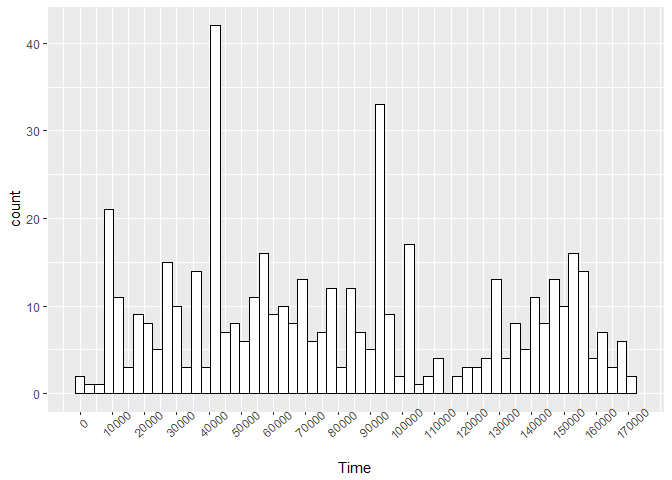
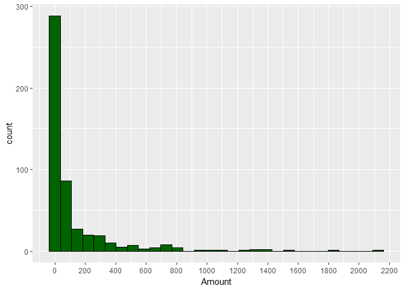
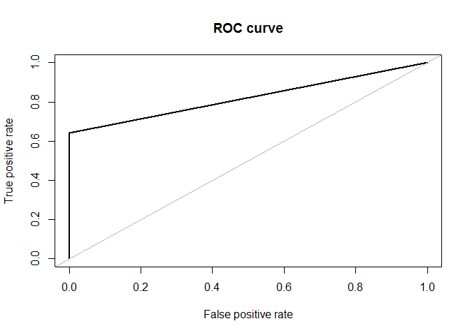
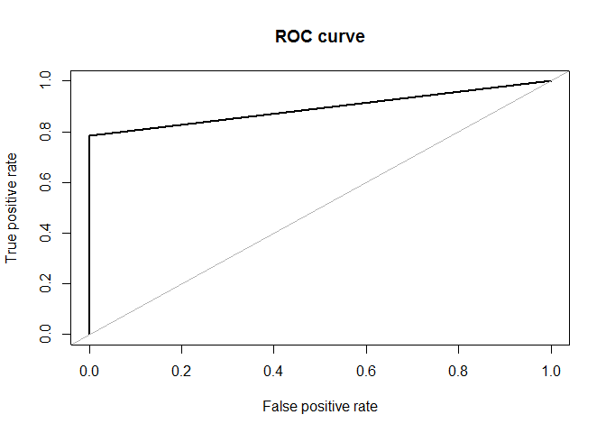
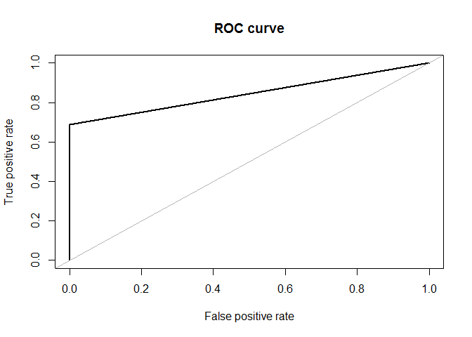
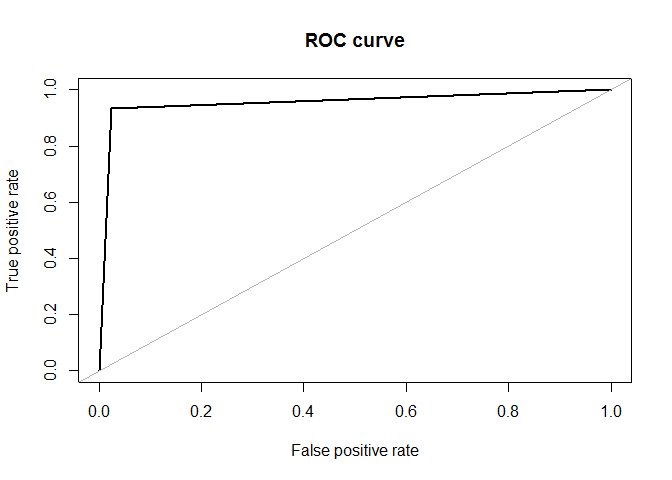
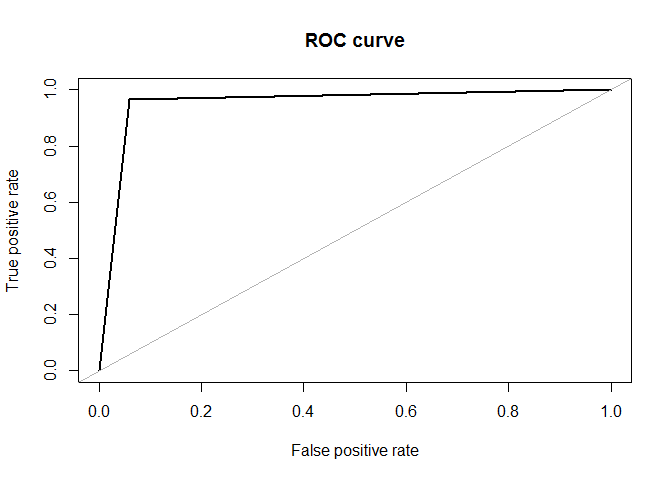
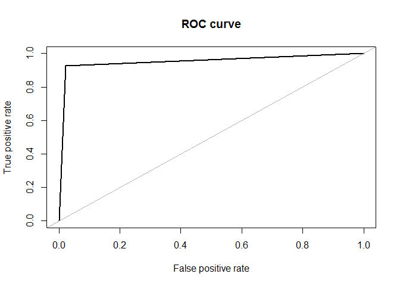
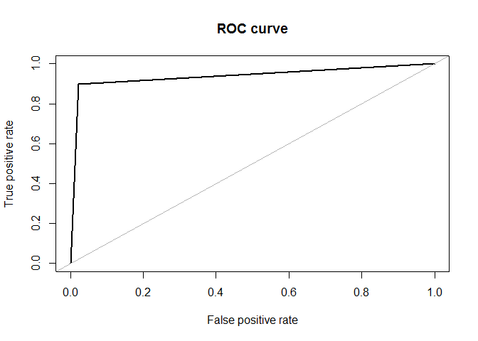
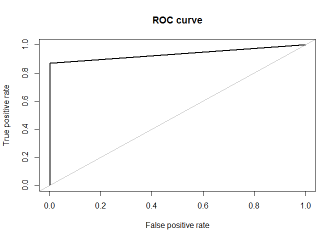

Credit Card Fraud Detection
=============================
**Author:-** Nihit R. Save <br />
**Date:-** 15th June 2017


Data Exploration
----------------

Lets load the dataset from csv file.

``` r
CCdata <- read.csv("creditcard.csv")
```

Lets see how our response variable is distributed.

``` r
table(CCdata$Class)
```

    ## 
    ##      0      1 
    ## 284315    492

``` r
prop.table(table(CCdata$Class))
```

    ## 
    ##           0           1 
    ## 0.998272514 0.001727486

Thus we see that we have only 492 fraudaulent observations which account for only 0.173% of data.

``` r
str(CCdata)
```

    ## 'data.frame':    284807 obs. of  31 variables:
    ##  $ Time  : num  0 0 1 1 2 2 4 7 7 9 ...
    ##  $ V1    : num  -1.36 1.192 -1.358 -0.966 -1.158 ...
    ##  $ V2    : num  -0.0728 0.2662 -1.3402 -0.1852 0.8777 ...
    ##  $ V3    : num  2.536 0.166 1.773 1.793 1.549 ...
    ##  $ V4    : num  1.378 0.448 0.38 -0.863 0.403 ...
    ##  $ V5    : num  -0.3383 0.06 -0.5032 -0.0103 -0.4072 ...
    ##  $ V6    : num  0.4624 -0.0824 1.8005 1.2472 0.0959 ...
    ##  $ V7    : num  0.2396 -0.0788 0.7915 0.2376 0.5929 ...
    ##  $ V8    : num  0.0987 0.0851 0.2477 0.3774 -0.2705 ...
    ##  $ V9    : num  0.364 -0.255 -1.515 -1.387 0.818 ...
    ##  $ V10   : num  0.0908 -0.167 0.2076 -0.055 0.7531 ...
    ##  $ V11   : num  -0.552 1.613 0.625 -0.226 -0.823 ...
    ##  $ V12   : num  -0.6178 1.0652 0.0661 0.1782 0.5382 ...
    ##  $ V13   : num  -0.991 0.489 0.717 0.508 1.346 ...
    ##  $ V14   : num  -0.311 -0.144 -0.166 -0.288 -1.12 ...
    ##  $ V15   : num  1.468 0.636 2.346 -0.631 0.175 ...
    ##  $ V16   : num  -0.47 0.464 -2.89 -1.06 -0.451 ...
    ##  $ V17   : num  0.208 -0.115 1.11 -0.684 -0.237 ...
    ##  $ V18   : num  0.0258 -0.1834 -0.1214 1.9658 -0.0382 ...
    ##  $ V19   : num  0.404 -0.146 -2.262 -1.233 0.803 ...
    ##  $ V20   : num  0.2514 -0.0691 0.525 -0.208 0.4085 ...
    ##  $ V21   : num  -0.01831 -0.22578 0.248 -0.1083 -0.00943 ...
    ##  $ V22   : num  0.27784 -0.63867 0.77168 0.00527 0.79828 ...
    ##  $ V23   : num  -0.11 0.101 0.909 -0.19 -0.137 ...
    ##  $ V24   : num  0.0669 -0.3398 -0.6893 -1.1756 0.1413 ...
    ##  $ V25   : num  0.129 0.167 -0.328 0.647 -0.206 ...
    ##  $ V26   : num  -0.189 0.126 -0.139 -0.222 0.502 ...
    ##  $ V27   : num  0.13356 -0.00898 -0.05535 0.06272 0.21942 ...
    ##  $ V28   : num  -0.0211 0.0147 -0.0598 0.0615 0.2152 ...
    ##  $ Amount: num  149.62 2.69 378.66 123.5 69.99 ...
    ##  $ Class : Factor w/ 2 levels "0","1": 1 1 1 1 1 1 1 1 1 1 ...

We see that besides the principal components of original features, we have other independent variables like Time and Amount. Lets explore them further.

``` r
library(ggplot2)

ggplot(subset(CCdata,CCdata$Class == 1),aes(x = Time)) + geom_bar(stat = "count",binwidth =3000,col = "black",fill = "white") + scale_x_continuous(breaks = seq(0,170000,10000)) + theme(axis.text.x = element_text(angle = 40))
```

    ## Warning: `geom_bar()` no longer has a `binwidth` parameter. Please use
    ## `geom_histogram()` instead.

 We observe 2 spikes at 40,000 and 90,000 units of time. If information about the units was available we would be able to find hours of day when most frauds take place.

``` r
ggplot(subset(CCdata,CCdata$Class == 1),aes(x = Amount)) + geom_histogram(col = "black",fill = "darkgreen") + scale_x_continuous(breaks = seq(0,2250,200))
```

    ## `stat_bin()` using `bins = 30`. Pick better value with `binwidth`.



We notice that most fraudulent transaction amount are less than 300.

Lets split the dataset into train and test set. We will split the dataset so that the original ratio of Class variable is preserved.

``` r
library(caTools)
set.seed(999)
index <- sample.split(CCdata$Class,SplitRatio = 70/100)
train <- CCdata[index,]
test <- CCdata[!index,]

train$Class <- as.factor(train$Class)
test$Class <- as.factor(test$Class)
```

Data Modelling
--------------

### Model Evaluation Function

If we use accuracy to evaluate model performance it will mislead us since predicting all observations as not fraud will result in 99.8% accuracy. Thus we will use:- Confusion Matrix - to help us understand correct and incorrect predictions. AUC - to

``` r
library(ROSE)
library(caret)
modelper <- function(x){
  list("Confusion Matrix" = confusionMatrix(test$Class,x)$table,"ROC" =  roc.curve(test$Class,x))
  }
```

### Training Base Models

Lets train 3 base models:- Logistic Regression,Decision Tree and SVM model.

``` r
LRmodel <- glm(Class~.,family = "binomial",data = train)
LRprobab <- predict(LRmodel,newdata = test,type = "response")
LRpred <- ifelse(pred >= 0.5,1,0)
```

Lets evaluate the performance of our base logistic regression model.

``` r
modelper(LRpred)
```



    ## $`Confusion Matrix`
    ##           Reference
    ## Prediction     0     1
    ##          0 85278    17
    ##          1    53    95
    ## 
    ## $ROC
    ## Area under the curve (AUC): 0.821

We notice that most of the non fraud observations were correctly classified but about 2/3 fraudulent observations were incorrectly classified. Our priority should be to classify as much fraudulent observations as possible because classifying non fraud as fraud is better than classifying fraud as non fraud.

Lets see how Decision tree and SVM perform.

``` r
DTmodel <- rpart(Class~.,data = train,method = "class")
DTpred <- predict(DTmodel,newdata = test,type = "class")
```

``` r
modelper(DTpred)
```



    ## $`Confusion Matrix`
    ##           Reference
    ## Prediction     0     1
    ##          0 85287     8
    ##          1    32   116
    ## 
    ## $ROC
    ## Area under the curve (AUC): 0.892

Decision tree performs better than logistic regression, classifying 116 fraudulent observations correctly but still misclassifies 32 observations.

``` r
library(e1071)
SVMmodel <- svm(Class~.,data = train)
SVMpred <- predict(SVMmodel,newdata = test)
```

``` r
modelper(SVMpred)
```



    ## $`Confusion Matrix`
    ##           Reference
    ## Prediction     0     1
    ##          0 85291     4
    ##          1    46   102
    ## 
    ## $ROC
    ## Area under the curve (AUC): 0.845

While SVM classifies 4 more non fraudulent observations than decision tree correctly,it provides no improvement in classifying fraudulent observations.

Training Models on Oversampled Data
-----------------------------------

Oversampling replicates the observations from minority class,thus balancing the data.

``` r
trainOver <- ovun.sample(Class~.,data = train,method = "over", p = 0.5)
OStrain <- trainOver$data
```

``` r
table(OStrain$Class)
```

    ## 
    ##      0      1 
    ## 199020 199414

Originally we had 199020 non fraud and 344 fraud observations in train set.Lets see distribution in oversampled train

``` r
table(OStrain$Class)
```

    ## 
    ##      0      1 
    ## 199020 199414

Thus we see that the distribution of Class is roughly equal.

Lets train models on oversampled train

``` r
LRmodelOS <- glm(Class~.,family = "binomial",data = OStrain)
LRprobOS <- predict(LRmodelOS,newdata = test,type = "response")
LRpredOS <-  ifelse(LRpredOS > 0.5,1,0)
```

``` r
modelper(LRpredOS)
```



    ## $`Confusion Matrix`
    ##           Reference
    ## Prediction     0     1
    ##          0 83212  2083
    ##          1    10   138
    ## 
    ## $ROC
    ## Area under the curve (AUC): 0.954

Thus the logistic regression model successfully classifies 138 observation giving a huge boost in performance compare to previous models.

``` r
DTmodelOS <- rpart(Class~.,data = OStrain,method = "class")
DTpredOS <- predict(DTmodelOS,newdata = test,type = "class")
```

``` r
modelper(DTpredOS)
```


    ## $`Confusion Matrix`
    ##           Reference
    ## Prediction     0     1
    ##          0 81686  3609
    ##          1    11   137
    ## 
    ## $ROC
    ## Area under the curve (AUC): 0.942

We observe that DT model provides no improvement over logistic regression model.

``` r
SVMmodelOS <- svm(Class~.,OStrain,probability = TRUE)
SVMpredOS <- predict(SVMmodelOS,newdata = test)
```

``` r
modelper(SVMpredOS)
```


    ## $`Confusion Matrix`
    ##           Reference
    ## Prediction     0     1
    ##          0 84702   593
    ##          1    30   118
    ## 
    ## $ROC
    ## Area under the curve (AUC): 0.895

SVM also does not perform better than logistic regression model.

Training Models on Undersampled Data
------------------------------------

Undersampling reduces the number of observations from majority class to make the data set balanced.

``` r
trainUnder <- ovun.sample(Class~.,data = train,method = "under", p = 0.5)
UStrain <- trainUnder$data
```

``` r
table(UStrain$Class)
```

    ## 
    ##   0   1 
    ## 342 344

The non fraud observations has gone down to 342,giving us a balanced dataset. Now lets train models on undersampled dataset.

``` r
LRmodelUS <- glm(Class~.,family = "binomial",data = UStrain)
 LRprobUS <- predict(LRmodelUS,newdata = test,type = "response")
 LRpredUS <-  ifelse(LRprobUS > 0.5,1,0)
```

``` r
modelper(LRpredUS)
```


    ## $`Confusion Matrix`
    ##           Reference
    ## Prediction     0     1
    ##          0 81896  3399
    ##          1     9   139
    ## 
    ## $ROC
    ## Area under the curve (AUC): 0.950

We notice that logistic regression model on undersampled train performs better than any of the previous models.

``` r
DTmodelUS <- rpart(Class~.,data = UStrain,method = "class")
DTpredUS <- predict(DTmodelUS,newdata = test,type = "class")
```

``` r
modelper(DTpredUS)
```



    ## $`Confusion Matrix`
    ##           Reference
    ## Prediction     0     1
    ##          0 80219  5076
    ##          1     5   143
    ## 
    ## $ROC
    ## Area under the curve (AUC): 0.953

Decision Tree on undersampled data performs much better than any of the models but misclassifies 5000 of non fraud observations.

``` r
SVMmodelUS <- svm(Class~.,UStrain,probability = TRUE)
SVMpredUS <- predict(SVMmodelUS,newdata = test)
```

``` r
modelper(SVMpredUS)
```



    ## $`Confusion Matrix`
    ##           Reference
    ## Prediction     0     1
    ##          0 83332  1963
    ##          1    11   137
    ## 
    ## $ROC
    ## Area under the curve (AUC): 0.951

SVM on undersampled data doesnt provide much improvement over previous models.

Training models on ROSE dataset
-------------------------------

ROSE (Random Over Sampling Examples) package helps us to generate artificial data based on sampling methods and smoothed bootstrap approach.

``` r
bootstraping - https://www.thoughtco.com/what-is-bootstrapping-in-statistics-3126172
```

``` r
trainR <- ROSE(Class~.,data = train)
ROSEtrain <- trainR$data
```

``` r
table(ROSEtrain$Class)
```

    ## 
    ##      0      1 
    ##  99333 100031

Thus we observe that our dataset was minority class was oversampled by adding artificial data points and majority class was undersampled.

Now lets train models on this dataset.

``` r
LRmodelROSE <- glm(Class~.,family = "binomial",data = ROSEtrain)
LRprobROSE <- predict(LRmodelROSE,newdata = test,type = "response")
LRpredROSE <- ifelse(LRprobROSE > 0.5,1,0)
```

``` r
modelper(LRpredROSE)
```


    ## $`Confusion Matrix`
    ##           Reference
    ## Prediction     0     1
    ##          0 84230  1065
    ##          1    13   135
    ## 
    ## $ROC
    ## Area under the curve (AUC): 0.950

We see that logistic regression model does quite well in classifying both the classes but not good enough.

``` r
DTmodelROSE <- rpart(Class~.,data = ROSEtrain,method = "class")
DTpredROSE <- predict(DTmodelROSE,newdata = test,type = "class")
```

``` r
modelper(DTpredROSE)
```



    ## $`Confusion Matrix`
    ##           Reference
    ## Prediction     0     1
    ##          0 83362  1933
    ##          1    15   133
    ## 
    ## $ROC
    ## Area under the curve (AUC): 0.938

Decision Tree model provides no additional improvement over previous models.

``` r
SVMmodelROSE <- svm(Class~.,ROSEtrain,probability = TRUE)
SVMpredROSE <- predict(SVMmodelROSE,newdata = test)
```

``` r
modelper(SVMpredROSE)
```



    ## $`Confusion Matrix`
    ##           Reference
    ## Prediction     0     1
    ##          0 85151   144
    ##          1    19   129
    ## 
    ## $ROC
    ## Area under the curve (AUC): 0.935

SVM does good job at classifying non fraud observations but misclassifies 19 fraud observations.

Training models on SMOTE dataset
--------------------------------

The Synthetic Minority Over-sampling TEchnique (SMOTE) is an oversampling approach that creates synthetic minority class samples.

``` r
library(DMwR)
SMOTEtrain <- SMOTE(Class ~.,data = train,perc.over = 200,k = 5,perc.under = 200)
```

``` r
table(SMOTEtrain$Class)
```

    ## 
    ##    0    1 
    ## 1376 1032

As we can see from above, minority observations have increased to 1032.

Now lets train models on this dataset.

``` r
LRmodelSMOTE <- glm(Class~.,family = "binomial",data = SMOTEtrain)
LRprobSMOTE <- predict(LRmodelSMOTE,newdata = test,type = "response")
LRpredSMOTE <- ifelse(LRprobSMOTE > 0.5,1,0)
```

``` r
modelper(LRpredSMOTE)
```


    ## $`Confusion Matrix`
    ##           Reference
    ## Prediction     0     1
    ##          0 82985  2310
    ##          1     9   139
    ## 
    ## $ROC
    ## Area under the curve (AUC): 0.956

Logistic regression on SMOTE dataset does a decent job of classifying both the classes.

``` r
library(rpart)
DTmodelSMOTE <- rpart(Class~.,data = SMOTEtrain,method = "class")
DTpredSMOTE <- predict(DTmodelSMOTE,newdata = test,type = "class")
```

``` r
modelper(DTpredSMOTE)
```


    ## $`Confusion Matrix`
    ##           Reference
    ## Prediction     0     1
    ##          0 81598  3697
    ##          1     8   140
    ## 
    ## $ROC
    ## Area under the curve (AUC): 0.951

As compared to logistic regression, decision tree model classifies more fraud observations but also misclassifies more non fraud observations.

``` r
SVMmodelSMOTE <- svm(Class~.,SMOTEtrain,probability = TRUE)
SVMpredSMOTE <- predict(SVMmodelSMOTE,newdata = test)
```

``` r
modelper(SVMpredSMOTE)
```


    ## $`Confusion Matrix`
    ##           Reference
    ## Prediction     0     1
    ##          0 84329   966
    ##          1    14   134
    ## 
    ## $ROC
    ## Area under the curve (AUC): 0.947

SVM again does not perform better than previous models.

Training models by assigning Class Weights
------------------------------------------

We will assign more weight to minority class as compared to majority class. For this purpose we will use the distribution of classes to determine weights. Following formula was derived from python class\_weight argument of Classifier method.

``` r
model_weights <- ifelse(train$Class == 0,
                         nrow(train)/(2*table(train$Class)[1]),
                         nrow(train)/(2*table(train$Class)[2]))
```

``` r
table(model_weights)
```

    ## model_weights
    ## 0.500864234750276  289.773255813953 
    ##            199020               344

Thus we can see that non fraud observations were assigned a weight of 0.5 while fraud observations were assigned weight of 289.77.

Change this

``` r
lmw <- glm(Class~.,data = train,family = binomial,weights = model_weights)
lmwprob <- predict(lmw,newdata = test,type = "response")
lmwpred <- ifelse(lmwprob > 0.5,1,0)
```

``` r
modelper(lmwpred)
```


    ## $`Confusion Matrix`
    ##           Reference
    ## Prediction     0     1
    ##          0 83214  2081
    ##          1    10   138
    ## 
    ## $ROC
    ## Area under the curve (AUC): 0.954

We get a decent outcome for both the classes but it can be improved.

``` r
DTweighted <- rpart(Class ~., data = train,weights = model_weights,method = "class")
DTpredweighted <- predict(DTweighted,newdata = test,type = "class")
```

``` r
modelper(DTpredweighted)
```


    ## $`Confusion Matrix`
    ##           Reference
    ## Prediction     0     1
    ##          0 81686  3609
    ##          1    11   137
    ## 
    ## $ROC
    ## Area under the curve (AUC): 0.942

Change This.

``` r
SVMweighted2 <- svm(Class~.,data = train,class.weights = c("0" = 0.5,"1" = 289.77),probability = TRUE)
SVMweighted <- SVMweighted2
SVMweightedpred <- predict(SVMweighted,newdata = test)
```

``` r
modelper(SVMweightedpred)
```


    ## $`Confusion Matrix`
    ##           Reference
    ## Prediction     0     1
    ##          0 85048   247
    ##          1    36   112
    ## 
    ## $ROC
    ## Area under the curve (AUC): 0.877

Both the models dont perform better than logistic regression model in classifying fraud observations.

DT: type = "prob" LR: type = "response"

Cost Matrix Anomaly Detection

Ensembling different models
===========================

Lets try averaging different probabilities and then predict outcome.

``` r
predictions <- data.frame(LRpred,DTpred,SVMpred,LRpredOS,DTpredOS,SVMpredOS,LRpredUS,DTpredUS,SVMpredUS,LRpredROSE,DTpredROSE,SVMpredROSE,LRpredSMOTE,DTpredSMOTE,SVMpredSMOTE,lmwpred,DTpredweighted,SVMweightedpred,WApred)
```

``` r
auc <- data.frame()
for(i in 1:ncol(predictions)){
  a <- modelper(predictions[,i])
  #auc[i,1] <- colnames(predictions)[i]
  auc[i,1] <- colnames(predictions)[i]
  auc[i,2] <- a$ROC$auc
  
  for(j in 1:length(a$confumat$byClass)){
    auc[i,j+2] <- a$confumat$byClass[j]
  }
}

colnames(auc)[1] <- "PredictionName"
colnames(auc)[2] <- "AUC"
colnames(auc)[3:13] <- names(a$confumat$byClass)
```

Amongst all the models we have trained, we will select the models with highest auc.

``` r
probLR <- data.frame(LRprobSMOTE,LRprobOS,lmwprob)
```

But first we must check the correlation of these probabilities so that the average we get is not same as that of a model.

``` r
cor(probLR)
```

    ##             LRprobSMOTE  LRprobOS   lmwprob
    ## LRprobSMOTE   1.0000000 0.8724429 0.8714001
    ## LRprobOS      0.8724429 1.0000000 0.9998152
    ## lmwprob       0.8714001 0.9998152 1.0000000

As we see all the models are highly correlated and ensembling them would result in same AUC.

remove this

Lets select one logistic regression model and other models with high AUC.

``` r
prob <- data.frame(LRprobSMOTE,DTprobUS$`1`,SVMprobdummmy$`1`) #SVMpredUS
```

``` r
cor(prob)
```

    ##                   LRprobSMOTE DTprobUS..1. SVMprobdummmy..1.
    ## LRprobSMOTE         1.0000000    0.4268415         0.6162950
    ## DTprobUS..1.        0.4268415    1.0000000         0.4779392
    ## SVMprobdummmy..1.   0.6162950    0.4779392         1.0000000

As seen from above, the 3 selected models are not correlated. We shall take weighted average of probabilities, assigning more weight to prediction with highest AUC.

``` r
WAprob <- (prob$LRprobSMOTE*0.4 + prob$DTprobUS..1.*0.3 + prob$SVMprobdummmy..1. * 0.3)

WApred <- ifelse(WAprob > 0.5,1,0)
```

``` r
modelper(WApred)
```


    ## $`Confusion Matrix`
    ##           Reference
    ## Prediction     0     1
    ##          0 82987  2308
    ##          1     9   139
    ## 
    ## $ROC
    ## Area under the curve (AUC): 0.956

Thus we get a very minute improvement over logistic regression model on SMOTE train.

Closing Remarks
---------------

1\] Random Forest wasn't used due to computational limitations. 2\] KNN wasn't also used because it gave 'too many ties' error. 3\] Ensembling other models might give better results 4\] Anomaly detection approach can also be used to detect fraud transactions.

Fraudulent transaction detector (positive class is "fraud"): Optimize for sensitivity FN as a variable Because false positives (normal transactions that are flagged as possible fraud) are more acceptable than false negatives (fraudulent transactions that are not detected)

------------------------------------------------------------------------

Original KNN combine train and test then scale

x

``` r
LRprobUS <- predict(LRmodelUS,type = "response",newdata = test)

DTprobUS <- as.data.frame(predict(DTmodelUS,type = "prob",newdata = test))
SVMprobUS <- predict(SVMmodelUS,probability = T,newdata = test)
SVMprob <- as.data.frame(attr(SVMprobUS, "prob"))
SVMprobdummmy <- as.data.frame(SVMprob )


prob <- data.frame(LRprobUS,DTprobUS$`1`,SVMprobdummmy$`1`) #as.data.frame
```

``` r
cor(prob)
```

    ##                   LRprobSMOTE DTprobUS..1. SVMprobdummmy..1.
    ## LRprobSMOTE         1.0000000    0.4268415         0.6162950
    ## DTprobUS..1.        0.4268415    1.0000000         0.4779392
    ## SVMprobdummmy..1.   0.6162950    0.4779392         1.0000000

``` r
WAprob <- (prob$LRprobUS*0.4) + (prob$DTprobUS..1.*0.3) + (prob$SVMprobdummmy..1.*0.3)
WApred <- ifelse(WAprob > 0.5,1,0)
```
